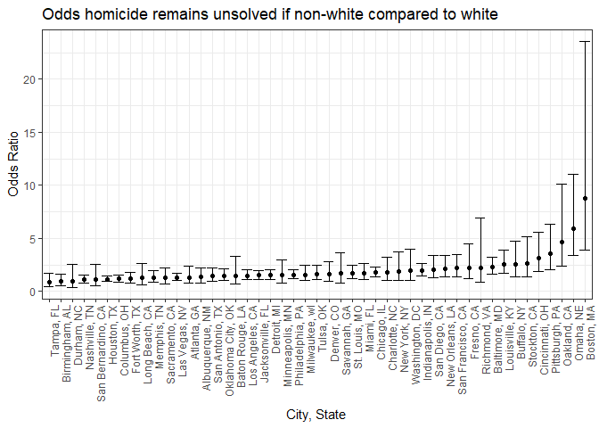

hw6
================
Brennan Baker
November 26, 2018

-   [Problem 1](#problem-1)
    -   [Load and tidy data](#load-and-tidy-data)
    -   [Baltimore model](#baltimore-model)
    -   [Models for all cities](#models-for-all-cities)
-   [Problem 2](#problem-2)

Problem 1
=========

``` r
library(tidyverse)
```

    ## -- Attaching packages ------------------------------------------------------------ tidyverse 1.2.1 --

    ## v ggplot2 2.2.1     v purrr   0.2.5
    ## v tibble  1.4.2     v dplyr   0.7.6
    ## v tidyr   0.8.1     v stringr 1.3.1
    ## v readr   1.1.1     v forcats 0.3.0

    ## -- Conflicts --------------------------------------------------------------- tidyverse_conflicts() --
    ## x dplyr::filter() masks stats::filter()
    ## x dplyr::lag()    masks stats::lag()

``` r
library(forcats)
```

### Load and tidy data

``` r
homicides_df = read_csv(file = "./data-homicides-master/homicide-data.csv")
```

    ## Parsed with column specification:
    ## cols(
    ##   uid = col_character(),
    ##   reported_date = col_integer(),
    ##   victim_last = col_character(),
    ##   victim_first = col_character(),
    ##   victim_race = col_character(),
    ##   victim_age = col_character(),
    ##   victim_sex = col_character(),
    ##   city = col_character(),
    ##   state = col_character(),
    ##   lat = col_double(),
    ##   lon = col_double(),
    ##   disposition = col_character()
    ## )

``` r
homicides_df = homicides_df %>% 
  mutate(city_state = str_c(city, ",\ ", state)) %>% 
  filter(!city_state %in% c("Dallas, TX", "Phoenix, AZ", "Kansas City, MO", "Tulsa, AL")) %>% 
  mutate(victim_age = as.numeric(victim_age)) %>% 
  filter(!is.na(victim_age)) %>% 
  filter(victim_race != "unknown") %>% 
  mutate(victim_race = ifelse(victim_race == "White", "white", "non-white")) %>% 
  mutate(victim_race = as.factor(victim_race)) %>% 
  mutate(victim_race = relevel(victim_race, ref = "white")) %>% 
  mutate(resolution = factor(ifelse(
    disposition %in% c("Closed without arrest", "Open/No arrest"), "unresolved", "resolved")))
```

    ## Warning in evalq(as.numeric(victim_age), <environment>): NAs introduced by
    ## coercion

After importing the data, I created a city\_state variable. I excluded cities that have errors or do not report race. I converted age to numeric and removed NA age rows. I filtered out unknown race and recoded race as white or non-white, with white as the reference group. I removed unknown race because if the race is unknown, we cannot know if race is white or non-white. I recoded the disposition variavle as solved or unsolved.

### Baltimore model

``` r
baltimore_fit = homicides_df %>%
  filter(city_state == "Baltimore, MD") %>% 
  glm(resolution ~ victim_age + victim_race + victim_sex, data = ., family = binomial())
```

The above code saves a logistic regression to baltimore\_glm. The model uses victim age, race, and sex to predict whether the case is resolved or unresolved.

``` r
baltimore_fit %>% broom::tidy(conf.int = TRUE) %>% 
  mutate(OR = exp(estimate),
         conf.low = exp(conf.low),
         conf.high = exp(conf.high)) %>% 
  select(term, OR, conf.low, conf.high) %>% 
  filter(term == "victim_racenon-white") %>% 
  knitr::kable(digits = 3)
```

| term                  |    OR|  conf.low|  conf.high|
|:----------------------|-----:|---------:|----------:|
| victim\_racenon-white |  2.27|     1.614|      3.203|

The above table shows the estimate and confidence interval of the odds ratio for resolved vs unresolved homicides predicted by race, controling for age and sex.

### Models for all cities

``` r
homicides_models = homicides_df %>% 
  group_by(city_state) %>% 
  nest() %>% # now we have a list col called data containing all the data for each city state
  mutate(model = map(data, ~broom::tidy(glm(resolution ~ victim_age + victim_race + victim_sex, data = ., family = binomial()), conf.int = TRUE))) %>%
  select(-data) %>% 
  unnest() %>%
  mutate(OR = exp(estimate),
         conf.low = exp(conf.low),
         conf.high = exp(conf.high)) %>% 
  select(city_state, term, OR, conf.low, conf.high) %>%
  filter(term == "victim_racenon-white")

homicides_models %>% knitr::kable(digits = 3)
```

| city\_state        | term                  |     OR|  conf.low|  conf.high|
|:-------------------|:----------------------|------:|---------:|----------:|
| Albuquerque, NM    | victim\_racenon-white |  1.349|     0.823|      2.225|
| Atlanta, GA        | victim\_racenon-white |  1.328|     0.770|      2.356|
| Baltimore, MD      | victim\_racenon-white |  2.270|     1.614|      3.203|
| Baton Rouge, LA    | victim\_racenon-white |  1.498|     0.712|      3.285|
| Birmingham, AL     | victim\_racenon-white |  0.962|     0.570|      1.635|
| Boston, MA         | victim\_racenon-white |  8.730|     3.868|     23.525|
| Buffalo, NY        | victim\_racenon-white |  2.565|     1.409|      4.761|
| Charlotte, NC      | victim\_racenon-white |  1.794|     1.052|      3.194|
| Chicago, IL        | victim\_racenon-white |  1.779|     1.362|      2.316|
| Cincinnati, OH     | victim\_racenon-white |  3.141|     1.847|      5.558|
| Columbus, OH       | victim\_racenon-white |  1.170|     0.867|      1.577|
| Denver, CO         | victim\_racenon-white |  1.661|     0.992|      2.796|
| Detroit, MI        | victim\_racenon-white |  1.536|     1.150|      2.052|
| Durham, NC         | victim\_racenon-white |  0.997|     0.408|      2.562|
| Fort Worth, TX     | victim\_racenon-white |  1.194|     0.791|      1.809|
| Fresno, CA         | victim\_racenon-white |  2.233|     1.181|      4.498|
| Houston, TX        | victim\_racenon-white |  1.146|     0.918|      1.432|
| Indianapolis, IN   | victim\_racenon-white |  1.982|     1.503|      2.626|
| Jacksonville, FL   | victim\_racenon-white |  1.519|     1.160|      1.993|
| Las Vegas, NV      | victim\_racenon-white |  1.324|     1.029|      1.708|
| Long Beach, CA     | victim\_racenon-white |  1.260|     0.623|      2.638|
| Los Angeles, CA    | victim\_racenon-white |  1.502|     1.092|      2.078|
| Louisville, KY     | victim\_racenon-white |  2.552|     1.695|      3.888|
| Memphis, TN        | victim\_racenon-white |  1.278|     0.862|      1.926|
| Miami, FL          | victim\_racenon-white |  1.735|     1.135|      2.651|
| Milwaukee, wI      | victim\_racenon-white |  1.581|     1.019|      2.511|
| Minneapolis, MN    | victim\_racenon-white |  1.549|     0.831|      2.933|
| Nashville, TN      | victim\_racenon-white |  1.113|     0.810|      1.534|
| New Orleans, LA    | victim\_racenon-white |  2.146|     1.357|      3.400|
| New York, NY       | victim\_racenon-white |  1.882|     1.012|      3.695|
| Oakland, CA        | victim\_racenon-white |  4.695|     2.391|     10.109|
| Oklahoma City, OK  | victim\_racenon-white |  1.468|     1.031|      2.096|
| Omaha, NE          | victim\_racenon-white |  5.920|     3.356|     11.024|
| Philadelphia, PA   | victim\_racenon-white |  1.553|     1.176|      2.064|
| Pittsburgh, PA     | victim\_racenon-white |  3.552|     2.061|      6.359|
| Richmond, VA       | victim\_racenon-white |  2.235|     0.869|      6.933|
| San Antonio, TX    | victim\_racenon-white |  1.451|     0.975|      2.181|
| Sacramento, CA     | victim\_racenon-white |  1.281|     0.742|      2.256|
| Savannah, GA       | victim\_racenon-white |  1.677|     0.795|      3.640|
| San Bernardino, CA | victim\_racenon-white |  1.136|     0.500|      2.540|
| San Diego, CA      | victim\_racenon-white |  2.069|     1.285|      3.397|
| San Francisco, CA  | victim\_racenon-white |  2.182|     1.391|      3.472|
| St. Louis, MO      | victim\_racenon-white |  1.733|     1.222|      2.472|
| Stockton, CA       | victim\_racenon-white |  2.662|     1.403|      5.172|
| Tampa, FL          | victim\_racenon-white |  0.863|     0.436|      1.710|
| Tulsa, OK          | victim\_racenon-white |  1.660|     1.142|      2.432|
| Washington, DC     | victim\_racenon-white |  1.960|     1.011|      4.005|

The above code uses a map function to run the model that we used with baltimore on each city\_state.

``` r
homicides_models %>% 
  mutate(city_state = forcats::fct_reorder(city_state, OR)) %>%
  ggplot(aes(x = city_state, y = OR)) + 
      geom_point() +
      geom_errorbar(aes(ymin = conf.low, ymax = conf.high)) +
      labs(
        x = "City, State",
        y = "Odds Ratio",
        title = "Odds homicide remains unsolved if non-white compared to white") +
      theme_bw() +
      theme(axis.text.x = element_text(angle = 90, hjust = 1))
```



The above plot shows that Boston is the US city with the largest discrepancy in homicide resolutions between white and non-white victims. In Boston, non-white victim homicides are 8.7 times as likely to remain unresolved compared to white victim homicides.

Problem 2
=========
